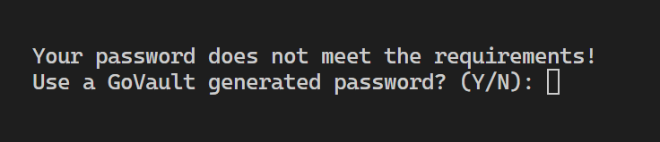
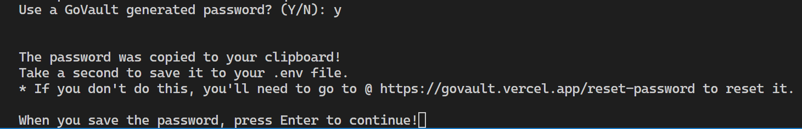
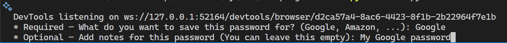
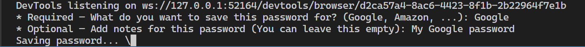
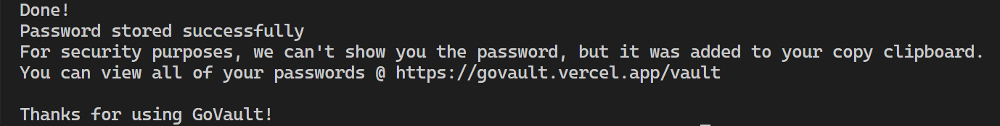

# GoVault Bot 🤖🔐

[](https://www.python.org/downloads/)
[](https://pypi.org/project/selenium/)
[](./LICENSE)

GoBot is a simple CLI automation script that logs in to your GoVault account (or creates one), a password manager app I built with the MERN stack + Next.js. It generates a secure password, and saves it, complete with labels and notes—directly from your terminal.

## Table of Contents

- [Motivation](#motivation)
- [Features](#features)
- [Requirements](#requirements)
- [Setup & Installation](#setup--installation)
- [Usage](#usage)
- [Troubleshooting](#troubleshooting)
- [Contributing](#contributing)
- [License](#license)

---

## 🧠 About GoVault

[GoVault](https://govault.vercel.app) is a secure password management app I built using the **MERN stack** (MongoDB, Express, React, Node.js) with a **Next.js frontend**.

It allows users to generate strong passwords, store them with labels and notes, and access them across devices.

This CLI bot is built to automate GoVault from your terminal, especially useful for developers or power users.

➡️ [Check out the GoVault source code](https://github.com/AmarMuric04/govault)

---

## Motivation

Managing dozens of logins can be tedious and insecure.  
**GoBot** automates the routine: it interfaces with your [GoVault](https://govault.vercel.app) password store, so you can generate and save strong passwords without leaving your terminal.

---

## Features

- 🚀 **Quick Login/Create**: Automatically logs in or provisions a new account
- 🔐 **Password Generation**: Create compliant passwords or accept your own
- 🏷️ **Labels & Notes**: Annotate each password entry
- 📋 **Clipboard Copy**: One‑click copy to clipboard
- ✨ **CLI Spinner**: Smooth, informative progress feedback

---

## Requirements

- **Python** 3.8+
- **Google Chrome** (latest recommended)
- **ChromeDriver** matching your Chrome version (in your PATH)

---

## Setup & Installation

1. **Clone the repo**

   ```bash
   git clone https://github.com/AmarMuric04/govault-bot.git
   cd gobot
   ```

2. **Install dependencies**

   ```bash
   pip install -r requirements.txt
   ```

3. **Configure environment**

   ```bash
   cp .env.example .env

   # Edit .env and set:

   # GOVAULT_EMAIL=you@example.com

   # GOVAULT_PASSWORD=YourStrongPass!123

   ```

   > **Tip:** If your password doesn’t meet complexity, the bot can generate one for you.

4. **Run the bot**
   ```bash
   python main.py
   ```

---

## Usage

1. **Login or Create**  
   The bot checks your credentials and auto‑creates an account if needed.
2. **Password Prompt**  
   Choose to supply your own compliant password or generate one.
3. **Label & Notes**  
   Provide a service label (e.g. “GitHub”) and optional notes.
4. **Save & Copy**  
   Wait ~10–15 seconds for the entry to save, then your password is in your clipboard!

---

## 📸 Screenshots

| Prompt                | Enter Custom Password | Bot Generates One      |
| --------------------- | --------------------- | ---------------------- |
|  |  |  |

| Add Service Info            | Spinner While Saving   | Done!                |
| --------------------------- | ---------------------- | -------------------- |
|  |  |  |

---

## Troubleshooting

- **ChromeDriver Mismatch**  
  Ensure your ChromeDriver version matches Google Chrome:
  ```bash
  chromedriver --version
  google-chrome --version
  ```
- **Permission Errors**  
  On \*nix, you may need to make ChromeDriver executable:
  ```bash
  chmod +x $(which chromedriver)
  ```
- **Network Timeouts**  
  If login hangs, check your connection and retry after a few seconds.

---

## Contributing

Contributions are welcome! Please:

1. Fork the repo
2. Create a feature branch: `git checkout -b feature/YourFeature`
3. Commit changes: `git commit -m "feat: add …"`
4. Push: `git push origin feature/YourFeature`
5. Open a Pull Request

Please see [CONTRIBUTING.md](./CONTRIBUTING.md) and [CODE_OF_CONDUCT.md](./CODE_OF_CONDUCT.md) for details.

---

## 📦 Dependencies

Here’s a breakdown of the main dependencies used in this project:

- 🕸️ selenium - Used to automate the browser and interact with the GoVault website (e.g., clicking buttons, filling forms, extracting data).
- 🌱 python-dotenv - Loads environment variables (like email and password) from a .env file for secure configuration.
- 📋 pyperclip- Used for copying the generated password to the clipboard.

---

## License

This project is licensed under the **MIT License**.  
See the [LICENSE](./LICENSE) file for details.
